<div align="center">

<a href="#-tactical-security-console--live-interface-showcase">
  
</a>

<br/>


<br/><br/>

[](https://www.python.org/)
[](https://fastapi.tiangolo.com/)
[](https://nextjs.org/)
[](https://github.com/Rohanjm911/CONTRAX)
[](https://github.com/Rohanjm911/CONTRAX)
[](https://opensource.org/licenses/MIT)
[](https://swcregistry.io/)

---

**CONTRAX** is an enterprise-grade smart contract cybersecurity analysis workbench. Built on a high-contrast **Tactical Carbon & Telemetry** design system, CONTRAX unifies static AST semantic parsing, Slither static detector passes, Mythril symbolic execution paths, EVM gas profiling, and Web3 on-chain inspection into an intuitive, auditor-grade workflow.

> **"See the flaw before they do."**

</div>

---

## 🖥️ Tactical Security Console & Live Interface Showcase

CONTRAX is designed around a military-grade, dark cyberpunk **Tactical Cyan & Amber Radar** visual hierarchy, eliminating cognitive fatigue during smart contract audits and giving security teams immediate tactical situational awareness.

### 1. Executive Operations Console & Threat Posture Gauge
<div align="center">
  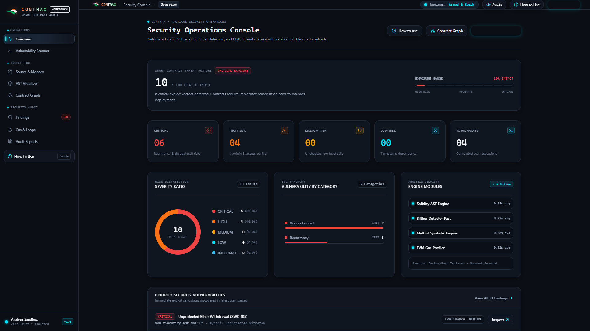
  <p align="center"><i><b>Executive Overview:</b> Real-time 0–100 Threat Posture health index, exposure gauge, severity ratio donut chart, SWC taxonomy breakdown, and multi-engine velocity metrics.</i></p>
</div>

<br/>

### 2. Multi-Engine Vulnerability Scanner & Dropzone
<div align="center">
  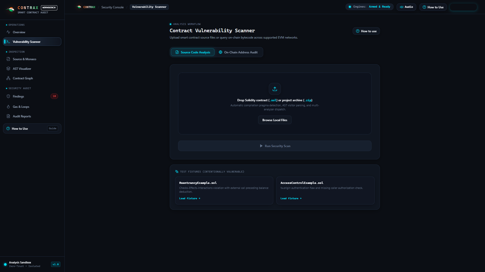
  <p align="center"><i><b>Scan Pipeline HUD:</b> Drag-and-drop Solidity files (.sol) or project archives (.zip), on-chain address importer, and instant test fixtures for reentrancy and access control.</i></p>
</div>

<br/>

### 3. Vulnerability Detection Matrix
<div align="center">
  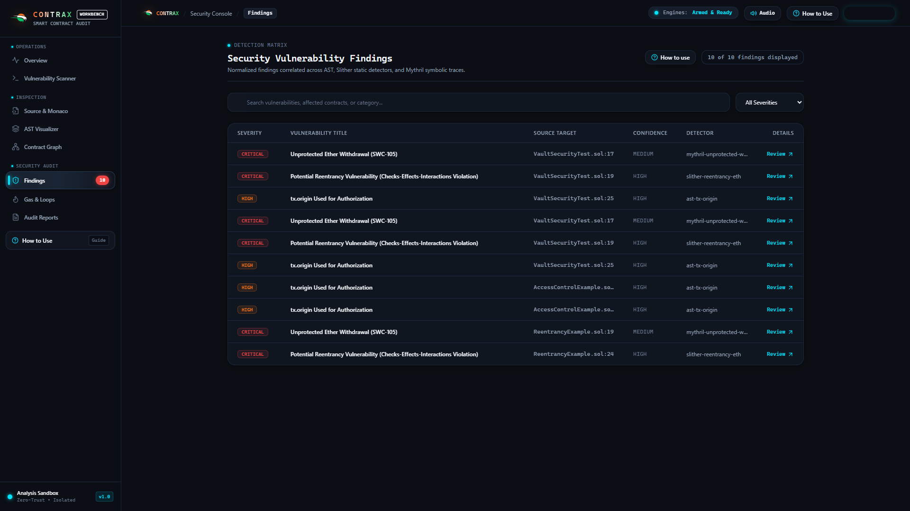
  <p align="center"><i><b>Findings Matrix:</b> Prioritized vulnerability table with severity badges (Critical, High, Medium, Low), source targets with line numbers, detector provenance, confidence ratings, and review triggers.</i></p>
</div>

<br/>

### 4. Vulnerability Remediation & Deep Inspection Sheet
<div align="center">
  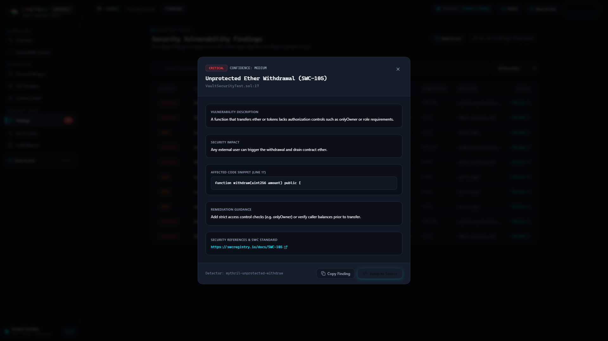
  <p align="center"><i><b>Remediation Inspector:</b> Deep dive modal displaying affected code snippets, plain-English security impact, developer remediation guidance, and official SWC registry links.</i></p>
</div>

<br/>

### 5. Integrated Monaco IDE & Inline Security Annotations
<div align="center">
  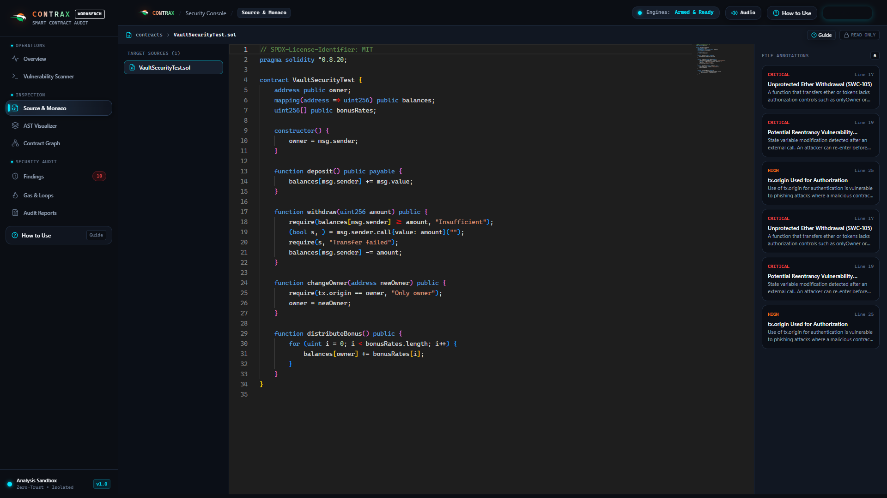
  <p align="center"><i><b>Monaco Source Viewer:</b> Embedded VS Code engine with Solidity syntax highlighting, contract file explorer, and interactive sidebar annotations linked directly to vulnerable lines.</i></p>
</div>

<br/>

### 6. Interactive AST Semantic Hierarchy Explorer
<div align="center">
  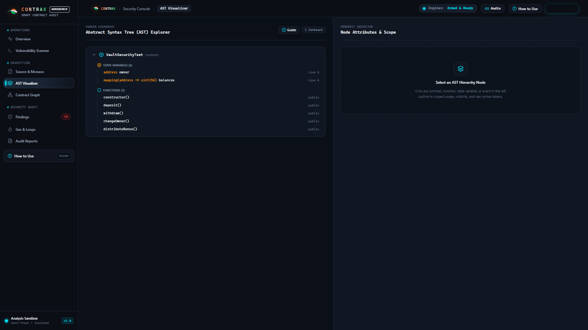
  <p align="center"><i><b>AST Visualizer:</b> Tree hierarchy decomposing contract declarations, state variables, modifiers, events, and functions with a dedicated node attributes inspector.</i></p>
</div>

<br/>

### 7. Interactive SVG Contract Relationship Graph & Call Flow
<div align="center">
  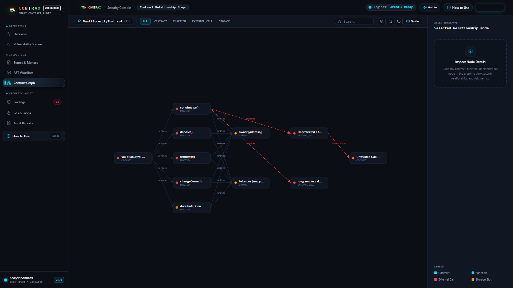
  <p align="center"><i><b>Relationship Visualizer:</b> Interactive node-link topology rendering contracts, function entrypoints, storage slot writes, external invocations, and fund flow vectors with category filtering.</i></p>
</div>

<br/>

### 8. EVM Gas & Loop Execution Profiler
<div align="center">
  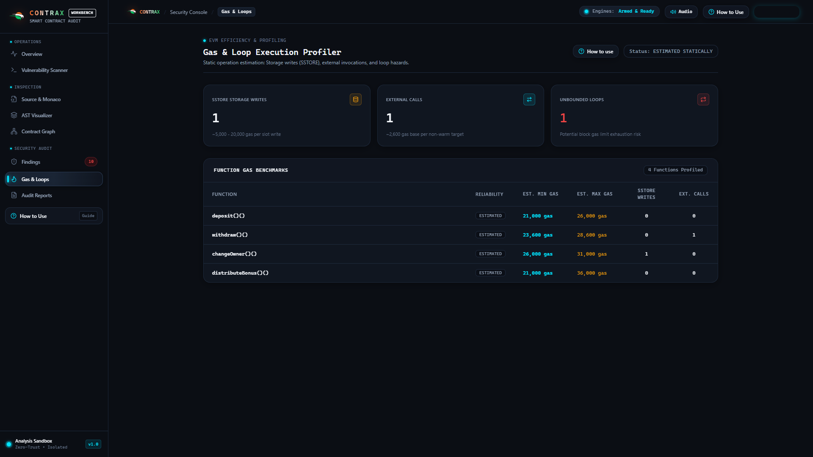
  <p align="center"><i><b>Gas & Opcode Intelligence:</b> Per-function min/max/average gas consumption benchmarks, SSTORE write counters, external call counts, and unbounded loop hazard warnings.</i></p>
</div>

<br/>

### 9. Security Audit Reports & Compliance Console
<div align="center">
  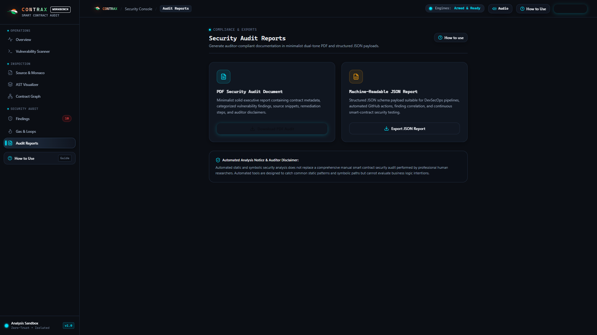
  <p align="center"><i><b>Audit Reporting:</b> Dual-tone formal PDF audit generation with cryptographic verification seal, executive score summary, and machine-readable JSON exports for CI/CD DevSecOps.</i></p>
</div>

<br/>

### 10. Interactive Auditor Guidance & Feature Walkthrough
<div align="center">
  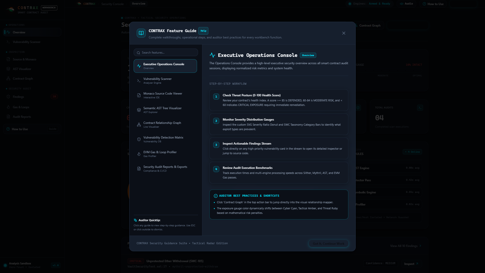
  <p align="center"><i><b>Feature Guide:</b> Step-by-step guidance modal detailing operational workflows, scoring methodology, auditor best practices, and keyboard shortcuts.</i></p>
</div>

---

## ⚡ One-Click Instant Launch (Windows)

To start the entire CONTRAX platform with a single click:

```cmd
start_contrax.bat
```

- Automatically verifies Python 3.10+ and Node.js / npm
- Launches the FastAPI backend daemon on `http://127.0.0.1:8000`
- Launches the Next.js frontend dev server on `http://localhost:3000`
- Opens the CONTRAX Security Console automatically in your default browser

To stop all background services cleanly, run [stop_contrax.bat](file:///d:/projects%20and%20certificates/projects/block/Contrax/stop_contrax.bat).

---

## 🎯 Real-Time Threat Radar & Vulnerability Telemetry

<div align="center">
  
</div>

---

## 🏛️ Multi-Engine Pipeline Architecture

<div align="center">
  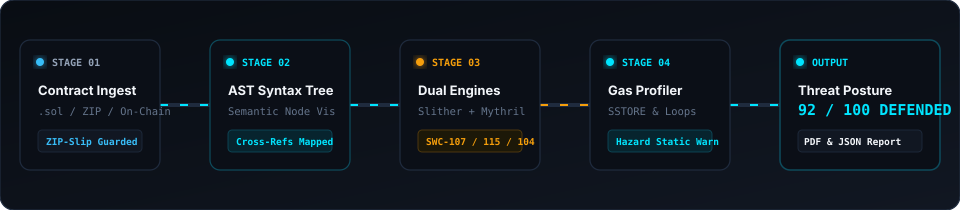
</div>

CONTRAX orchestrates multiple static and symbolic engines asynchronously without blocking user requests:

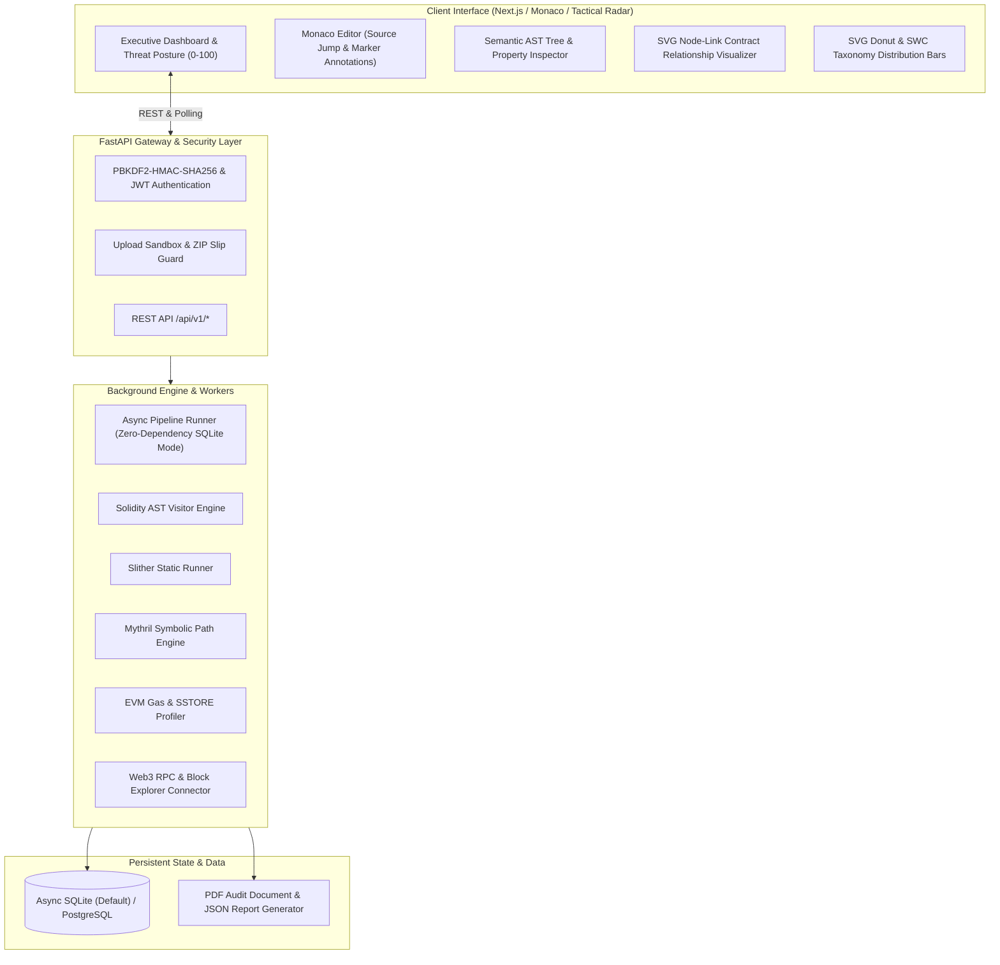

---

## ✨ Key Features

| Capability | Technical Details |
| :--- | :--- |
| **Executive Threat Posture** | Real-time 0–100 security scoring calculated via normalized severity weightings (`CRITICAL = -30`, `HIGH = -15`, `MEDIUM = -8`, `LOW = -3`). |
| **Contract Relationship Graph** | Interactive SVG node-link visualizer rendering contract definitions, function entrypoints, external invocations, and storage slot modifications. |
| **Interactive Monaco Viewer** | Embedded VS Code Monaco editor with colored severity markers, hover tooltips, and click-to-jump navigation from finding to source line. |
| **Interactive AST Explorer** | Visualizes contract hierarchies, state variables, modifiers, events, and functions with a dedicated node inspector. |
| **EVM Gas Profiler** | Detects expensive operations: `SSTORE` storage writes, external cross-contract calls, and unbounded loop hazards. Statically marked as `ESTIMATED`. |
| **SVG Visual Risk Distribution** | Custom SVG Severity Donut Chart with active segment hover and SWC Taxonomy horizontal distribution bars. |
| **Auditor-Ready Reports** | One-click generation of dual-tone **PDF Audit Reports** and machine-readable **JSON reports** suitable for CI/CD pipelines. |

---

## 🎨 Design System: Tactical Cyan & Amber Radar

CONTRAX utilizes a military aerospace radar design language for zero visual fatigue and instant telemetry discernment:

- **Carbon Canvas & Gunmetal Surfaces**:
  - **Void Canvas:** `#0B0E14` (Tactical Carbon)
  - **Surface Panels:** `#111722` (Gunmetal Base)
  - **Elevated Cards:** `#17202E` (Gunmetal Raised)
  - **Inset Workspaces:** `#0B0F17` (Terminal Recessed)
  - **Hairline Steel Dividers:** `#1F2B3E` / `#293B54`
- **Telemetry & Semantic Accents**:
  - `PRIMARY TELEMETRY / SAFE / RADAR` &rarr; Cyber Cyan (`#00E5FF`, Glow: `rgba(0, 229, 255, 0.25)`)
  - `CAUTION / WARNING / HIGH` &rarr; Tactical Amber (`#F59E0B`, Amber Orange: `#F97316`)
  - `THREAT / CRITICAL / HAZARD` &rarr; Ruby Crimson (`#EF4444`, Alert Glow)
  - `LOW / NOTICE` &rarr; Sky Blue (`#38BDF8`)
- **Typography Matrix**:
  - **Primary Metric Readouts:** `#F3F6FA` (High-Contrast Radar White)
  - **Secondary Telemetry Labels:** `#94A3B8` (Tactical Slate)
  - **Muted Coordinates & Offsets:** `#64748B` (Steel Dim)

---

## 📂 Project Directory Structure

```
contrax/
├── assets/                            # Brand assets, logos, vector banners, and UI suite
│   ├── contrax_logo.png               # Official CONTRAX brand logo (Wordmark & Subtitle)
│   ├── contrax_logo_mark.png          # High-resolution circular/wing emblem mark
│   ├── contrax_logo_1024.png          # Master 1024x1024 high-DPI brand asset
│   ├── contrax_header_banner.svg      # Animated radar header banner
│   ├── contrax_dashboard_real.png     # Full executive operations console & threat HUD
│   ├── contrax_scanner_real.png       # Multi-engine scanner pipeline HUD & dropzone
│   ├── contrax_findings_real.png      # Normalized vulnerability detection matrix
│   ├── contrax_modal_real.png         # Vulnerability remediation inspector sheet
│   ├── contrax_monaco_real.png        # Integrated Monaco IDE & inline annotations
│   ├── contrax_ast_real.png           # Solidity AST semantic hierarchy explorer
│   ├── contrax_graph_real.png         # Interactive SVG contract relationship graph
│   ├── contrax_gas_real.png           # EVM gas profiler & opcode hazard heatmap
│   ├── contrax_reports_real.png       # Formal audit report & compliance console
│   ├── contrax_guide_real.png         # Interactive auditor guidance & walkthrough
│   ├── scan_pipeline_animated.svg     # Animated multi-stage execution pipeline
│   └── threat_radar_animated.svg      # Animated 360-degree radar HUD visualizer
│
├── start_contrax.bat                  # One-click Windows launch script
├── stop_contrax.bat                   # One-click Windows shutdown script
├── README.md                          # Main project presentation & documentation
├── HOW_TO_RUN.md                      # Step-by-step launch & local execution guide
├── PACKAGES_AND_EXTENSIONS_NEEDED.md  # Comprehensive package & VS Code extensions catalog
├── .env.example                       # Environment variable templates
├── docker-compose.yml                 # Multi-service production topology
│
├── docs/                              # Deep technical specifications
│   ├── architecture.md                # System topology and component design
│   ├── api.md                         # Complete REST API reference
│   ├── security.md                    # Threat model & untrusted code sandboxing
│   ├── deployment.md                  # Docker & reverse proxy deployment guide
│   └── analysis-engine.md             # AST, Slither, Mythril, & Gas engine internals
│
├── backend/                           # FastAPI async backend service
│   ├── app/
│   │   ├── config/                    # Settings & structured logging
│   │   ├── core/                      # Security utilities, JWT, PBKDF2 password hashing
│   │   ├── db/                        # SQLAlchemy async database models & schema setup
│   │   ├── schemas/                   # Pydantic validation schemas
│   │   ├── analyzers/                 # Modular analyzer pipeline (AST, Slither, Mythril, Gas)
│   │   ├── blockchain/                # RPC and block explorer connectors
│   │   ├── reports/                   # PDF and JSON report generators
│   │   ├── utils/                     # Secure upload, ZIP bomb protection, pragma extraction
│   │   └── api/v1/                    # REST routers (auth, projects, contracts, scans, etc.)
│   ├── tests/                         # Pytest unit, integration, and security test suites
│   ├── requirements.txt               # Backend Python dependencies
│   └── Dockerfile
│
├── frontend/                          # Next.js 14+ App Router frontend
│   ├── app/                           # App pages and root layouts
│   ├── components/
│   │   ├── dashboard/                 # Executive Console & Threat Posture
│   │   ├── scanner/                   # Real-time scan pipeline & progress
│   │   ├── findings/                  # Findings detection matrix & modal sheets
│   │   ├── editor/                    # Monaco Source Viewer & file hierarchy
│   │   ├── ast/                       # AST semantic tree explorer
│   │   ├── contract-graph/            # Interactive SVG node-link graph
│   │   ├── charts/                    # Donut chart, Category bars, Gas profiler
│   │   └── ui/                        # Compliance & PDF/JSON reports
│   ├── styles/                        # Tactical Radar Tailwind CSS & globals
│   ├── package.json                   # Frontend npm dependencies
│   └── Dockerfile
│
└── contracts/samples/                 # Testing fixtures
    ├── ReentrancyExample.sol          # Checks-Effects-Interactions violation
    ├── AccessControlExample.sol       # tx.origin authentication & missing access controls
    ├── UncheckedCallExample.sol       # Unchecked low-level external call return value
    └── TimestampExample.sol           # Weak randomness & miner timestamp dependency
```

---

## 🛠️ Tech Stack

<div align="center">

| Domain | Technologies |
| :--- | :--- |
| **Backend** | Python 3.11+, FastAPI, SQLAlchemy (Async), Alembic, Pydantic v2, PBKDF2 |
| **Frontend** | Next.js 14, React 18, TypeScript, Tailwind CSS, Monaco Editor, Lucide Icons |
| **Analyzers** | Custom Solidity AST Visitor Engine, Slither Analyzer, Mythril Symbolic Execution |
| **Visualizations** | Native Responsive SVG Donut Chart, Horizontal Bar Chart, Node-Link Relationship Graph |
| **Infrastructure** | Async SQLite (Zero-Config Default), PostgreSQL, Redis, Docker, Docker Compose |
| **Web3 & RPC** | `web3.py`, Etherscan API, Polygonscan, Arbiscan, Ankr RPCs |
| **Reporting** | ReportLab (Dual-Tone Vector PDF Engine), Jinja2 |

</div>

---

## 🔍 Vulnerability Detection Coverage

CONTRAX correlates findings from multiple static and symbolic passes to detect issues across the **SWC Registry**:

- 🚨 **Checks-Effects-Interactions Reentrancy** (`SWC-107`)
- 🔑 **`tx.origin` Authorization Exploits** (`SWC-115`)
- ⚠️ **Unchecked Low-Level External Calls** (`SWC-104`)
- 💀 **Deprecated / Risky `selfdestruct` Operation** (`SWC-106`)
- 🛡️ **Dangerous `delegatecall` to Untrusted Targets** (`SWC-112`)
- ⏳ **Timestamp Dependency in State Checks** (`SWC-116`)
- 🎲 **Weak On-Chain Pseudo-Randomness** (`SWC-120`)
- 🔓 **Missing Function Access Controls** (`SWC-105`)
- ⛽ **High Gas SSTORE Loops and DoS Vectors**

---

## 🚀 Getting Started

### Option A: One-Click Quickstart (Recommended)
Double click [`start_contrax.bat`](file:///d:/projects%20and%20certificates/projects/block/Contrax/start_contrax.bat) to launch both FastAPI backend and Next.js frontend automatically.

### Option B: Manual Launch
1. **Backend:**
   ```bash
   cd backend
   python -m uvicorn app.main:app --host 127.0.0.1 --port 8000 --reload
   ```
   Interactive API docs: `http://127.0.0.1:8000/docs`

2. **Frontend:**
   ```bash
   cd frontend
   npm run dev
   ```
   Web console: `http://localhost:3000`

3. **Default Security Researcher Credentials:**
   - **Username:** `researcher`
   - **Password:** `ContraxAdmin2026!`

4. **Run Unit Tests:**
   ```bash
   cd backend
   python -m pytest tests/unit/ -v
   ```

---

## 📡 API Reference

All REST endpoints reside under the `/api/v1` namespace:

| Method | Endpoint | Description |
| :--- | :--- | :--- |
| `POST` | `/api/v1/auth/register` | Register new security researcher account |
| `POST` | `/api/v1/auth/login` | Authenticate credentials and obtain JWT bearer token |
| `GET` | `/api/v1/projects` | List active user projects |
| `POST` | `/api/v1/projects` | Create a new project workspace |
| `POST` | `/api/v1/contracts/upload` | Securely upload `.sol` or `.zip` project |
| `POST` | `/api/v1/contracts/import-onchain` | Query RPC and import on-chain verified contract |
| `GET` | `/api/v1/contracts/{id}/ast` | Retrieve parsed AST tree for interactive visualizer |
| `POST` | `/api/v1/scans` | Asynchronously initiate security scan pipeline |
| `GET` | `/api/v1/scans` | List all historical security audits |
| `GET` | `/api/v1/scans/{id}/status` | Poll real-time progress and stage breakdown |
| `GET` | `/api/v1/scans/{id}/findings` | Retrieve normalized vulnerability findings |
| `GET` | `/api/v1/findings` | Retrieve all findings across the workspace |
| `GET` | `/api/v1/gas/scan/{id}` | Retrieve function gas profiles |
| `GET` | `/api/v1/reports/scan/{id}/download-pdf` | Download formatted PDF audit report |

---

## 🛡️ Sandbox & File Upload Security

Because uploaded smart contracts represent **untrusted input**, CONTRAX enforces strict isolation:

1. **Path Traversal Shield**: Filenames are sanitized, preventing ZIP Slip directory traversal attacks (`../`).
2. **Decompression Bomb Protection**: Hard upload cap of `20MB` and uncompressed limit of `100MB` (max 250 files).
3. **No Arbitrary Script Execution**: Build scripts (`npm run build`, `make`, shell files) are **never** executed on the host.
4. **Execution Timeouts**: Subprocess scans are strictly capped at `300` seconds to defend against infinite symbolic trees.

---

## ⚖️ Auditor Disclaimer

> [!WARNING]
> **AUTOMATED SECURITY NOTICE:** CONTRAX is designed to assist security researchers and developers by flagging known vulnerability patterns and anomalies. **Automated static and symbolic analysis does not replace a manual smart contract security audit performed by professional human researchers.** Neither CONTRAX nor its developers assume liability for security vulnerabilities not caught by automated heuristics.

---

<div align="center">
<sub>CONTRAX • "See the flaw before they do." • Engineered for Web3 Security Excellence</sub>
</div>
